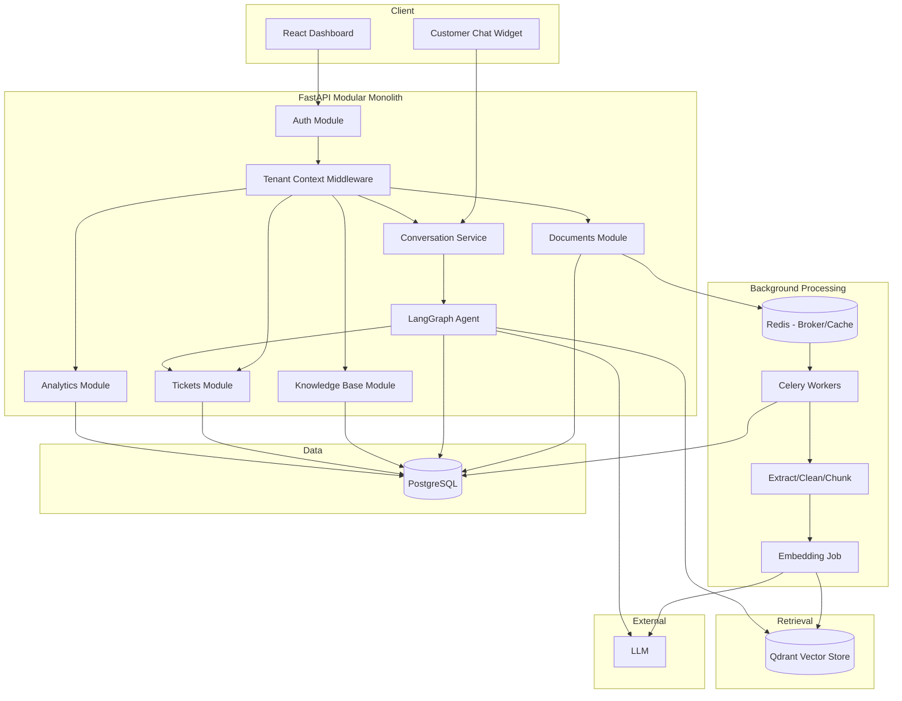

# Architecture

## 1. Business Requirements

- Multi-tenant from day one: this is a SaaS product for many companies, not a bespoke app for
  one customer. Retrofitting tenancy later is one of the most expensive mistakes in this class
  of system.
- Trust is the product: a support bot that hallucinates or leaks another tenant's data doesn't
  just fail a test — it damages the business selling it. Groundedness and isolation are core
  requirements, not late-stage hardening.
- Cost is bounded by usage: every conversation costs real money (LLM tokens, embeddings,
  storage), so the system must make per-tenant cost visible and controllable.
- Human handoff is a first-class workflow, not a fallback: support teams need a dashboard to
  review conversations and tickets, not just an API.

## 2. Functional Requirements

- Tenant signup/management, user auth, RBAC (`owner` / `admin` / `agent`)
- Knowledge base CRUD, document upload (PDF / TXT / Markdown to start), async processing
- Chunking → embedding → indexing pipeline (Qdrant)
- Customer-facing conversational endpoint (RAG + tool calling via LangGraph)
- Conversation history persistence, viewable in the dashboard
- Ticket creation (manual or agent-triggered), human handoff
- Admin dashboard: KB management, conversation review, tickets, analytics, per-tenant AI config
- Usage tracking (tokens, requests) for cost visibility

## 3. Non-Functional Requirements

| Concern | Target (v1) | Why |
|---|---|---|
| Tenant isolation | Zero cross-tenant leakage, proven by tests | The #1 way a multi-tenant AI SaaS gets breached |
| Latency (chat) | p95 < 3-4s for a RAG-augmented response | LLM + retrieval latency stack; tolerable but not unbounded |
| Availability | Graceful degradation, not five-nines HA | Early-stage system — design for honest failure |
| Auditability | Every tool call / retrieval / LLM call logged | Needed to debug hallucinations and for security review |
| Cost predictability | Per-tenant token/cost visibility | Determines whether the pricing model works at all |
| Scalability | Easy horizontal scale-out of API/workers | 10x traffic shouldn't need a rewrite, but we don't pre-pay for scale we don't have |

## 4. System Boundaries

**In scope:** document ingestion → conversational response → human handoff, tenant dashboard,
core observability and evaluation.

**Explicitly out of scope for v1:**
- Omnichannel integrations (email, Slack, WhatsApp) — a single chat API/widget first
- Fine-tuning custom models — API models only
- Full billing/metering (Stripe etc.) — usage is tracked, not billed, in v1
- SSO/SAML — JWT auth first, pluggable later
- Real-time voice — separate project

## 5. Architecture Decision: Modular Monolith

One deployable FastAPI service + Celery workers, internally organized into bounded-context
modules (`tenancy`, `auth`, `knowledge_base`, `documents`, `conversations`, `agent`, `tickets`,
`analytics`) with enforced boundaries: no module reaches into another module's models directly,
it goes through that module's service interface.

**Why not microservices now:**
- No independent scaling requirement exists yet — nothing is proven to need to scale separately
- Distributed transactions / eventual consistency between services is a real tax with zero
  benefit at this stage
- Network hops between services add latency exactly where the system is already
  latency-sensitive (LLM calls)
- Operational overhead (service discovery, multiple deploy pipelines, cross-service tracing)
  isn't justified pre-product-market-fit

**What would let us split later:** because modules only talk to each other through explicit
service interfaces (never shared ORM queries across a module boundary), the two most likely
extraction candidates are:
1. **Document processing** — CPU/IO heavy, independently scalable, no shared request-latency
   constraint with the API.
2. **Agent/RAG layer** — may eventually want its own deploy cadence, or even a different
   runtime, purely for LLM-call performance isolation.

We design the module boundary now; we build the network boundary only when there's a measured
reason to.

## 6. Main Components

1. **API layer (FastAPI)** — auth, tenant-scoped REST endpoints, validation, orchestration entrypoint
2. **Service layer** — business logic, tenant-aware, framework-agnostic (testable without HTTP)
3. **Data layer** — PostgreSQL via SQLAlchemy, tenant-scoped queries by construction
4. **Document processing workers (Celery)** — extraction, chunking, embedding, indexing
5. **Vector store (Qdrant)** — tenant-and-KB-filtered vector search
6. **Agent layer (LangGraph)** — retrieval, tool calls, quality gate, handoff decision
7. **Cache/broker (Redis)** — Celery broker, rate-limit state, short-term conversation cache
8. **Frontend (React)** — dashboard consuming the REST API
9. **Observability** — structured logs, latency/token/cost metrics across the RAG/agent pipeline

## 7. Data Flow

```
Customer message
  -> API (authenticate tenant + customer)
  -> Service layer (load conversation, tenant config)
  -> LangGraph agent
       -> retrieve from Qdrant (tenant + KB filtered)
       -> decide tool use (ticket, order lookup, escalate)
       -> generate grounded answer
       -> quality/confidence check
  -> persist message + metadata
  -> return response (or trigger handoff)
```

## 8. AI/LLM Flow

The LLM is invoked only where judgment is required: classification, answer generation,
confidence scoring. Orchestration itself is deterministic graph logic (LangGraph), not
LLM-driven — the graph controls *what can happen*; the LLM only decides *what to say or which
allowed tool to call*. This is deliberate: an unnecessarily autonomous agent is harder to
secure, test, and debug than a mostly-deterministic graph with a few LLM-reasoning nodes.

## 9. RAG Flow

```
Document -> extract text -> clean -> chunk (with overlap) -> attach metadata
  (tenant_id, kb_id, doc_id, source, page) -> embed -> upsert to Qdrant

Query -> embed query -> Qdrant search filtered by tenant_id + kb_id
  -> similarity threshold cutoff -> top-K chunks -> construct bounded context
  -> LLM answer, instructed to ground only in provided context
```

Chunking strategy, top-K, similarity thresholds, and retrieval failure modes are covered in
depth in `docs/rag.md` (Phase 4) — "vector search" alone is not "good RAG."

## 10. Background-Processing Flow

Document upload returns immediately: a `Document` row is created in `pending` state, a Celery
job is enqueued, and the worker moves it through
`processing -> chunking -> embedding -> indexed` (or `failed`), updating the row so the
dashboard can reflect status. This decouples slow, failure-prone I/O (PDF parsing, embedding
API calls) from the request/response cycle. Full retry/idempotency design in Phase 6.

## 11. Authentication & Authorization Model

- **AuthN:** JWT access + refresh tokens. Access token carries `user_id`, `tenant_id`, `role`.
- **AuthZ:** RBAC scoped *per tenant* (`owner` / `admin` / `agent`) — a role is meaningless
  without tenant context, so role checks always happen alongside tenant checks, never alone.
- **Tenant context propagation:** extracted once at the API boundary from the JWT (never
  trusted from a request body/query param), placed into a request-scoped context object
  (`core/tenancy.py`), and threaded explicitly through
  service → repository → Celery job payload → LangGraph state. See `docs/security.md` for the
  concrete re-validation rule at each hop, especially the async hop into a Celery worker.

## 12. Multi-Tenancy Model

**Decision for v1:** shared database, shared schema, `tenant_id` discriminator column on every
tenant-owned table, enforced at the repository layer — there is no code path that queries a
tenant table without a `tenant_id` filter (see `TenantScopedBase` in `db/base.py`).

Schema-per-tenant or database-per-tenant would buy stronger isolation but cost migration
complexity and connection-pool explosion at a stage with zero production tenants. Shared-schema
is the correct starting boundary, and the repository-layer enforcement means schema-per-tenant
could be adopted later without a full rewrite.

**Known tenant-isolation vulnerability classes** (tested explicitly in Phase 3/14):
- **IDOR** — fetching a resource by ID without also filtering by `tenant_id`
- **Vector store leakage** — a Qdrant query missing a tenant filter, or a filter built from
  client-supplied data instead of the authenticated JWT
- **Background job trust** — a Celery task that receives a `document_id`/`tenant_id` pair and
  doesn't re-derive/re-validate tenant ownership from the database before processing
- **Prompt injection + tenant confusion** — a retrieved chunk instructing the model to reveal
  another tenant's data must be structurally impossible (enforced by retrieval filtering), not
  merely prompted against

## 13. Failure Scenarios (full treatment in Phase 10 / `docs/reliability.md`)

OpenAI API outage/timeout, Qdrant unavailable, Redis down (breaks Celery + rate limiting),
Postgres connection exhaustion, a worker crashing mid-embedding (partial document indexed), an
LLM returning malformed structured output, a tool call failing mid-conversation. Each gets a
specific handling strategy, not a blanket try/except.

## Architecture Diagram



## Roadmap

See the phase list in the project root README. This document is updated as later phases refine
earlier decisions (each refinement is also captured as an ADR in `docs/adr/`).
